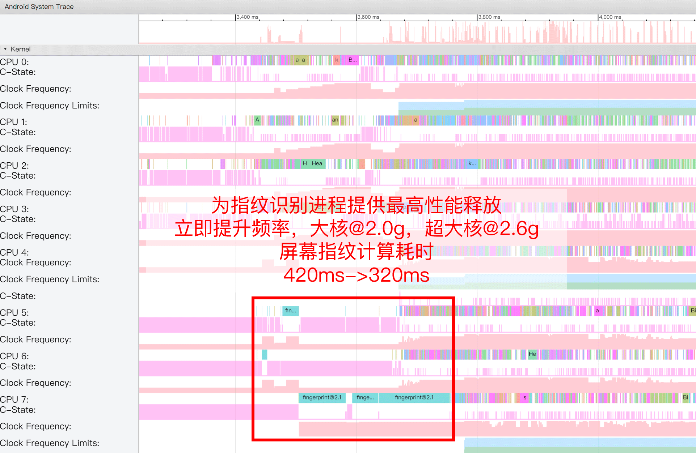

# Uperf

An Android user-mode performance controller that implements most kernel-mode upscaling functions and supports more scenario recognition.

## Main functions

- Dynamically set parameters to control performance release according to the identified scene type, supporting all `sysfs` nodes
- Support dynamic binding of UI-related threads of the operating APP to the large core cluster
- Read Android touch screen input signals from the Linux level to identify clicks and slides
- Actively sample system load to identify instantaneous heavy loads such as APP startup
- Listen to cpuset group update operations to identify switching of the operating APP
- Listen to wake-up lock update operations to identify whether the screen is off
- Listen to notifications sent by the hook injected into Surfaceflinger to identify rendering start, lag, and end
- Support Android 6.0 - 12
- Support arm64-v8a
- Support Magisk one-click installation, version not less than 20.4+
- Independent of Magisk, can be installed manually
- Unless SfAnalysis injection fails, SELinux can maintain `enforcing` in most cases
- Independent of any Android application layer framework and third-party kernel
- Provides parameterized configuration files for most popular hardware platforms

## Download

https://github.com/gtaswin/Uperf-BeastMode/releases

## Installation

### Magisk method

1. After downloading, flash it through Magisk Manager. The Magisk version should not be lower than 18.0

2. After restarting, check `/sdcard/Android/yc/uperf/uperf_log.txt` to check whether uperf starts normally

### Manual installation

1. If your device cannot install Magisk and has obtained ROOT permissions

2. Manually decompress after downloading, for example, decompress to `/data/uperf`

3. Modify the permissions of `setup_uperf.sh`, `run_uperf.sh`, and `initsvc_uperf.sh` to 755

4. Execute `setup_uperf.sh` to complete the installation and check whether the output information has errors

5. Execute `run_uperf.sh` to start uperf and check whether the output information has errors
6. Open `/data/cache/injector.log` to check whether sfanalysis injection is successful
7. If the auto-start is associated with a third-party APP, set it to execute `run_uperf.sh` after the boot is complete
8. If the auto-start is associated with the system startup script, insert `sh /data/uperf/initsvc_uperf.sh`
9. After restarting, check `/sdcard/yc/uperf/uperf_log.txt` to check whether uperf is normally started automatically

### Performance mode switching

#### Modify the default performance mode at startup

1. Open `/sdcard/Android/yc/uperf/cur_powermode.txt`
2. Modify `auto`, where `auto` is the default performance mode used after booting. The optional modes are:

- `auto` responds dynamically according to the App in use
- `balance` balanced mode, slightly smoother and slightly more power-saving than the original factory
- `powersave` jamming mode, ensuring basic smoothness while reducing power consumption as much as possible
- `performance` power consumption mode, ensuring power consumption while providing more fluency
- `fast` performance mode, more aggressive than balanced mode

3. Restart

#### Switch performance mode after startup

Method 1:
Execute `sh /data/powercfg.sh balance`, where `balance` is the name of the performance mode you want to switch to.

Method 2:
Install [Scene](https://www.coolapk.com/apk/com.omarea.vtools) to bind the corresponding performance mode to the APP.

## Frequently Asked Questions

Q: Does it have a negative impact on standby power consumption?
A: Uperf has made a lot of low-power optimizations, and its own power consumption overhead is very low. In addition, in the standby mode of the pre-made configuration file, the number of cores awakened during standby is reduced and conservative frequency increase parameters are used. The optimization of standby power consumption mainly relies on reducing the wake-up time ratio. On this basis, Uperf can further reduce standby power consumption.

Q: Why is it still very power-consuming after using Uperf?
A: The power consumption of the AP part of the SOC mainly depends on the amount of calculation and the frequency used. Uperf can only control the performance release and improve the frequency selection to reduce power consumption. If the background APP has a large amount of calculation, it is impossible to significantly extend the battery life. This problem can be located through the process manager of the Scene toolbox.

Q: Do I need to turn off the system temperature control?
A: System temperature control is a hardware protection measure, or used to improve the user experience under high load. In most cases, there is no need to turn it off. If you encounter a situation where performance is severely limited, such as running a competitive game with a maximum CPU frequency limited to 1.4Ghz, please increase the threshold for temperature control intervention or turn off system temperature control.

Q: What is the relationship between Uperf and Scene toolbox?
A: The two software operate independently and do not depend on each other. Uperf implements interfaces that can be called by the Scene toolbox, such as performance mode switching and APP-based performance mode. If you do not install the Scene toolbox, you can also achieve performance mode switching. For details, see the usage method.

Q: Do I still need to turn off the system performance boost?
A: The script in the Uperf module has turned off most of the mainstream user-mode and kernel-mode upscaling. If there are unconventional upscaling, the user needs to turn it off by himself.

Q: I encountered some strange system failures. What happened?
A: Uperf can work normally on most platforms. During the testing phase, the following possible failures were collected:

- The desktop launcher does not respond to touch. This is currently only encountered in MIUI 12. If you encounter this problem, please delete `/data/adb/modules/uperf/enable_sfanalysis`
- The touch screen report is intermittently lost. Please check whether you are using apps such as automatic skip, especially those that support coordinate clicks
- Sleeping. User-mode applications will not affect system stability in theory. Please replace them with official kernels and ROMs

Q: When using Magisk to install, it prompts `not supported`. Why is this?
A: There is no pre-made configuration file for this hardware platform, and you may need to adapt it yourself.

## Detailed introduction

This is a new project after [Project WIPE](https://github.com/yc9559/cpufreq-interactive-opt), [Project WIPE v2](https://github.com/yc9559/wipe-v2), [Perfd-opt](https://github.com/yc9559/perfd-opt), and [QTI-mem-opt](https://github.com/yc9559/qti-mem-opt). In previous work, parameter adjustment was often based on an existing performance controller, which also means that how well it can be done in the end depends on the upper limit of the controller itself. After the EAS scheduler became mainstream, the ideas of the WIPE series could not be applied because the parameter freedom of EAS was too small. It was not until the Qualcomm Boost framework was used that a wider range of adjustments was achieved, and Perfd-opt was created. On the one hand, it was restricted by the functional limitations of the existing performance controller, and on the other hand, some old devices did not have these new performance controllers. If there are no conditions, we must create them. We wrote a user-mode performance controller for the entire Android platform.

User-mode performance control usually has a higher latency (because modifying sysfs nodes consumes relatively more time), but it is very close to the actual application scenario and can actively improve performance and reduce lag before some known heavy loads start. The general working mode is to send Hints in the Java layer of the system framework, and the service in the Native layer receives Hints and performs corresponding sysfs modifications, such as Qualcomm CAF Boost Framework and Power-libperfmgr.

Unlike other user-mode performance controllers, Uperf does not have a Java layer part, only the Native layer receives time notifications and active sampling, which means that there is no dependency on the system framework level. Therefore, she does not need to recompile the kernel, nor does she need to modify the Android framework source code, and she has almost no hardware platform restrictions. Her modification range covers all kernel-mode performance control that can be done, that is, without replacing the official kernel with no bugs, you can use input frequency boost (yes, a few old kernels do not have this), Dynamic Stune Boost, Devfreq Boost and other fancy boosts.

The following table compares the functions of several major performance optimization solutions:
| Function | Project WIPE | Perfd-opt(CAF) | libperfmgr | Uperf |
| :--------------------: | :----------: | :------------: | :--------: | :---: |
| HMP+interactive | ✔️ | | | ✔️ |
| EAS+schedutil | | ✔️ | ✔️ | ✔️ |
| Non-Qualcomm Platforms | ✔️ | | | ✔️ |
| Android < 8.0 | ✔️ | | | ✔️ |
| HMP Model Automatic Parameter Adjustment | ✔️ | | | ✔️ |
| CPU Affinity of UI Thread | | | | ✔️ |
| Click Boost | | | ✔️ | ✔️ |
| List Scroll Boost | | ✔️ | ✔️ | ✔️ |
| APP Startup Acceleration | | ✔️ | ✔️ | ✔️ |
| APK installation acceleration | | ✔️ | | |
| Standby optimization | | | | ✔️ |
| Frame rendering lag | | | | ✔️ |
| Rendering start and end | | | | ✔️ |
| Surfaceflinger complex synthesis | | | ✔️ | |
| Video recording scenario | | | ✔️ | |
| Multi-performance mode | ✔️ | ✔️ | | ✔️ |

### Scenario recognition

IO bandwidth weight for non-foreground apps

- Set system processes closely related to UI performance to the cgroup group of top-level apps
- Fix threads related to transition animations to large cores
- Reduce wake-up of most sensor threads on large cores
- Disable most kernel-mode and user-mode boost and hot-plug
- `interactive` and `schedutil` governors, `core_ctl`, and task scheduler peripheral parameters are consistent
- Provide maximum performance for fingerprint recognition (EAS platform)



## Custom configuration files

This project has provided parameter-adjusted Uperf configuration files for most popular hardware platforms, but there are always some cases where the pre-adjusted configuration is not suitable for your software and hardware platform, such as unpopular hardware platforms and custom kernels. In addition, there is also a need to customize existing pre-adjusted configuration files, such as increasing the minimum CPU frequency during interaction and increasing the GPU frequency range adjustment. Uperf was designed with this kind of demand in mind, opening almost all adjustable parameters and automatically reloading the configuration file after saving the change, improving the efficiency of debugging parameters on the mobile phone. The configuration file used by the Magisk module is located at `/sdcard/yc/uperf/cfg_uperf.json`.

### Meta information

```json
"meta": {
"name": "sdm855/sdm855+ v20200516",
"author": "yc@coolapk",
"features": "touch cpuload render standby sfanalysis"
}
```

| Field name | Data type | Description                                                                                       |
| ---------- | --------- | ------------------------------------------------------------------------------------------------- |
| name       | string    | Name of the configuration file                                                                    |
| author     | string    | Author information of the configuration file                                                      |
| features   | string    | List of features supported by the configuration file. Currently, the reserved field does not work |

`name` and `author` are reflected in the log as follows:

```
[13:03:33][I] CfgMgr: Using [sdm855/sdm855+ v20200516] by [yc@coolapk]
```

### Global parameters

```json
"common": {
"switchInode": "/sdcard/yc/uperf/cur_powermode",
"verboseLog": false,
"uxAffinity": true,
"stateTransThd": {
"heavyLoad": 1500,
"idleLoad": 1000,
"requestBurstSlack": 3000
},
"dispatch": [
{
"hint": "None",
"action": "normal",
"maxDuration": 0
},
{
"hint": "Tap",
"action": "interaction",
"maxDuration": 1500
},
...
]
}
```

| Field name        | Data type | Description                                                                                                                                               |
| ----------------- | --------- | --------------------------------------------------------------------------------------------------------------------------------------------------------- |
| switchInode       | string    | Inode node receiving performance mode switch                                                                                                              |
| verboseLog        | bool      | Enable detailed log for debugging Hint switching                                                                                                          |
| uxAffinity        | bool      | Enable automatic setting of UX threads, fix high-priority UX threads to large cores, and limit the demand response of low-priority threads                |
| heavyLoad         | int       | System load threshold for entering heavy load, see [Heavy Load Tracking and Limiting](#Heavy Load Tracking and Limiting) for details                      |
| idleLoad          | int       | System load threshold for exiting heavy load, see [Heavy Load Tracking and Limiting](#Heavy Load Tracking and Limiting) for details                       |
| requestBurstSlack | int       | Delay before responding to new heavy load requests in milliseconds, see [Heavy Load Tracking and Limiting](#Heavy Load Tracking and Limiting) for details |
| hint              | string    | Corresponds to the Hint type supported by Uperf                                                                                                           |
| action            | string    | Bound action name, customizable                                                                                                                           |
| maxDuration       | int       | Maximum duration of action in milliseconds                                                                                                                |

When Uperf starts, it will read the file corresponding to the path of `switchInode` to obtain the default performance mode, which is reflected in the log as follows:

```
[13:03:33][I] CfgMgr: Read default powermode from /sdcard/yc/uperf/cur_powermode
[13:03:33][I] CfgMgr: Powermode "(null)" -> "balance"
```

The file corresponding to the path of `switchInode` listens to the writing of the new mode name to complete the mode switch:

```shell
echo "powersave" > /sdcard/yc/uperf/cur_powermode
```

It is reflected in the log as follows:

```
[13:06:45][I] CfgMgr: Powermode "balance" -> "powersave"
```

The binding relationship of `dispatch` is reflected in the log as follows:

```
[13:03:33][I] CfgMgr: Bind HintNone -> normal
[13:03:33][I] CfgMgr: Bind HintTap -> interaction
[13:03:33][I] CfgMgr: Bind HintSwipe -> interaction
[13:03:33][I] CfgMgr: Bind HintHeavyLoad -> heavyLoad
[13:03:33][I] CfgMgr: Bind HintAndroidAM -> amSwitch
[13:03:33][I] CfgMgr: Bind HintStandby -> standby
[13:03:33][I] CfgMgr: Bind HintSflag -> sfLag
```

The two functions of `UxAffinity` and `SfAnalysis` are reflected in the log as follows: `[13:03:33][I] CfgMgr: UX affinity enabled ... [13:03:36][I] SfAnalysis: Surfaceflinger analysis connected` ### Platform information ```json "platform": { "clusterCpuId": [ 0, 4, 7 ], "efficiency": [ 120, 120, 120, 120, 220, 220, 220, 240 ], "knobs": [ { "name": "cpuFreqMax", "path": "/sys/devices/system/cpu/cpu%d/cpufreq/scaling_max_freq", "type": "cpufreq", "enable": true }, ... ]
}

```

| Field name | Data type | Description |
| ------------ | ----------- | --------------------------------------------------------------------- |
| clusterCpuId | int list | The first CPU ID of each cluster of multi-cluster CPUs |
| efficiency | int list | The relative co-frequency performance of each CPU core, with Cortex-A53@1.0g as 100, and the order corresponds to the CPU ID |
| knobs | object list | `sysfs` node list |

Each object in `knobs` is a `knob`, with the following properties:
| Field name | Data type | Description |
| ------ | -------- | -------------------------------------- |
| name | string | `sysfs` node name |
| path | string | `sysfs` node path |
| type | string | `sysfs` node type, see [Writer](#Writer) for details |
| enable | bool | Whether to enable, convenient for one-click disable during debugging |

When the `enable` field is false, it is reflected in the log as follows:
```

[13:03:33][I] CfgMgr: Ignored root/platform/knobs/topCSProcs [Disabled by config file]

```

When the `sysfs` node corresponding to the `path` field does not exist or cannot be written, it is reflected in the log as follows:
```

[13:03:33][I] CfgMgr: Ignored root/platform/knobs/bigHifreq [Path is not writable]

````

### Performance mode parameters

```json
"powermodes": [
{
"name": "balance",
"actions": {
"interaction": {
"cpuFreqMax": "18,18,22",
"cpuFreqMin": "10,10,8",
"cpuLoadBoost": "0,0,0,0,0,0,0,0",
"fgCpus": "0-3",
"topCSProcs": "com.android.systemui,system_server",
"fgSTProcs": "system_server",
"ddrBwMax": "6000",
"ddrBwMin": "2500",
"uxAffinity": "1"
},
...
},
...
},
...
]
````

| Field name   | Data type | Description                                                      |
| ------------ | --------- | ---------------------------------------------------------------- |
| name         | string    | Customizable, used to back up multiple versions of parameters    |
| Action name  | string    | Corresponds to the action name defined in `common/dispatch`      |
| `knob` name  | string    | Corresponds to the `sysfs` node name defined in `platform/knobs` |
| `knob` value | string    | For the format of the value, see [Writer](#Writer)               |

An action should set values ​​for all `knobs` defined in `platform/knobs`. Sometimes you need to intentionally skip setting some values, or reuse most of the settings of the previous action. You can omit some `knob` settings, but not all. When loading the configuration file, Uperf will prompt which values ​​are not set and will be skipped, which is reflected in the log as follows:

```
[13:03:33][I] CfgMgr: Ignored knobs in action root/powermodes/balance/actions/amSwitch:
[13:03:33][I] CfgMgr: cpuFreqMin llccBwMax llccBwMin ddrBwMax ddrBwMin l3LatBig ddrLatBig
```

### Example

Use Uperf to add UFS power saving shutdown for interactive and heavy loads to reduce the IO bottleneck problem in performance-critical scenarios.

The `sysfs` node path of the UFS energy saving switch is `/sys/devices/platform/soc/1d84000.ufshc/clkgate_enable`, which accepts string type writes. Writing "0" turns off UFS energy saving, and writing "1" turns on UFS energy saving. This node is named `ufsClkGateEnable`. Add the following text to the configuration file to complete the definition of `knob`:

```json
"platform": {
...
"knobs": [
...
{
"name": "ufsClkGateEnable",
"path": "/sys/devices/platform/soc/1d84000.ufshc/clkgate_enable",
"type": "string",
"enable": true,
"note": "UFS clock gate switch"
},
...
]
}
```

According to the definition in [Scenario Identification](#Scenario Identification), the interactive hint names are `Tap` and `Swipe`, and the heavy load hint name is `HeavyLoad`.

```json
"dispatch": [
...
{
"hint": "Tap",
"action": "interaction",
"maxDuration": 1500
},
{
"hint": "Swipe",
"action": "interaction",
"maxDuration": 3000
},
{
"hint": "HeavyLoad",
"action": "heavyLoad",
"maxDuration": 2000
},
...
}
```

According to the binding relationship between hint and action defined in the configuration file, you need to set the actions `interaction` and `heavyLoad` to turn off UFS energy saving, and keep UFS energy saving on for other actions. Add the following text to the configuration file to complete the action definition:

```json
"powermodes": [
{
"name": "balance",
"actions": {
"normal": {
...
"ufsClkGateEnable": "1",
...
},
"interaction": {
...
"ufsClkGateEnable": "0",
...
},
"heavyLoad": {
...
"ufsClkGateEnable": "0",
...
},
"amSwitch": {
...
},
"standby": {
...
"ufsClkGateEnable": "1",
...
},
"sfLag": {
...
},
},
},
{
"name": "powersave",
"actions": {
"normal": {
...
"ufsClkGateEnable": "1",
...
},
...
},
},
...
]
```

After changing the configuration file and saving it, Uperf will automatically create a new subprocess to load the new configuration file. If there is a problem with the new configuration file format, the new subprocess will be terminated and the old subprocess will be retained. Next, verify whether the actions set in the configuration file can be executed as expected and whether the value of the corresponding path has changed.

## Credits

- https://github.com/yc9559/uperf.git
